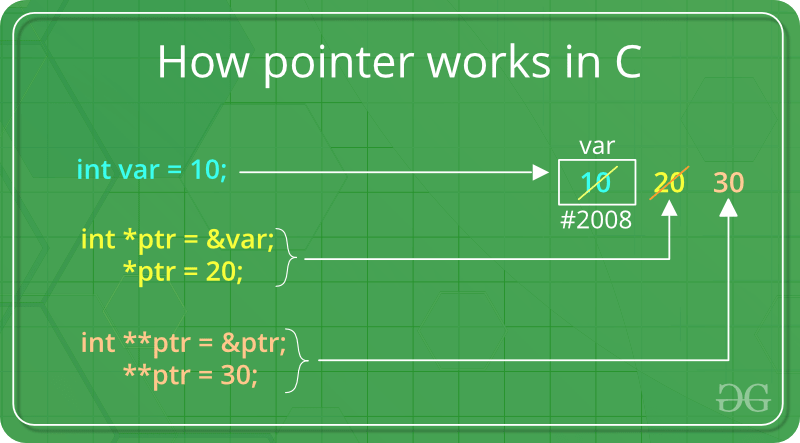

# Memory
> Learning about pointers

- When we look at photos, the more we zoom, the more pixelated it gets. This is because theres only so many bits or bytes associated with them that prescribe what color those dots should be.

Different formats for images:
- PNG
- JPEG
- GIF

The simplest of them is a bitmap image which is a map of bits horizontally and vertically conceptually with 0s and 1s.
- Example 0 is back and 1 is white.

When it comes to colour, we need more than 0 and 1, we probably need 24 - Pixel art.

This pixel art is meant to motivate the topic of manipulating data t a lower level, including images and other thing.

## Hexidecimal

- Images can be represented as RBG - Red Green Blue.
- We can represent this using another system.
- We have binary which is base 2.
- We have decimal, which is base 10.
- We have hexidecimal, where you have 16 digits at your disposal. So known as base 16.

Composes of 6 or 3 digits. 
- #000000 - Black.
- #ffffff - White.
- #ff0000 - Red.
- #00ff00 - Green.
- #0000ff - Blue

Why ff?
- Hexideximal gives another 6 digits in our vocabulary.
0123456789ABCDEF
They are called digits out of convention as we need more symbols.

How does this work mathamatically?
- If there are teo place holders ##, each represent the 16th to the 0th place, the 16th to the 1 place.
- 0f represents the number 15.
- ff is the highest we can count in hexidecimal.
- This is 16 times 15 plus 1 time 15 which gives me 255.
- Can represent a single hexidecimal digit wether its 0 or f, using 4 bits no matter what.
- We use 2 hexidecimal digits - 1111 1111, to be able to describe a single bite, known as a bit, using 2 digits rather than 8.

## Memory

- A memory address is represented in hexadecimal format, a base-16 numbering system. 
- This format uses numbers 0-9 and letters A-F, offering a more compact representation than binary. 
- Hexadecimal makes it easier for programmers to read and work with memory addresses.

#include <stdio.h>
int main(void)
{
    int n = 50;
    printf("%i\n", n);
}

- Whats going inside the memory in this case?
- The computer finds room in the computer to store n 50 in 4 bites (ints are 4 bites). 
- The address in which it might live could be placed at the location 0x123.

## Pointers

- & = address of operator. The compiler will tell you where that variable is in the computers memory.

- '*' = dereference operator. Goes to an address.

- %p = print pointers.
- A pointer is a variable that stores the address of something.

int n = 50;
int *p = &n;

> int *p
- This is saying that I want a variable called p, the type of this variable is a pointer, and I want it to be the address of an integer.

> &n
- The address of n. 

> int *p = &n;
- Wherever n is, get the address of it ike 0x123 and assign it to the variable p, which is a pointer to the address of an integer.

#include <stdio.h>

int main(void)
{
    int n = 50;
    int *p = &n;
    printf("%p\n", p);
}

When terminated, this gives an address of 0x7ffc6f5b451c
- If did the math, it would bea  very large decimal number.
- Why this number? The server has gigabytes of memory, billions of bytes.

#include <stdio.h>

int main(void)
{
    int n = 50;
    printf("%p\n", p);
}

If i take out int *p = &n;, I get a different address because things got organised in memory differently.

#include <stdio.h>

int main(void)
{
    int n = 50;
    int *p = &n;
    printf("%i\n", *p);
}

This gives me the integer 50.

- Two uses of the star opporator.
1. int *p = &n; - Declaring the pointer, creating the pointer, using star and type.
2. printf("%i\n", *p); - This means go there, dereference the address.

- Pointers are 64 bits, or 8 bytes.
- P is a variable whose value is an address.
- N is an integer at that address.

## Strings

string is not a standard c function.

> string s = "HI!";
- string s is storing the address of the first byte of the actual characters.
- The memory of a string starts at the 0th place in the array and ends at the null terminator \0.
- A string is just an address of its first character.

For example:
char *s = "HI!";
- A string is a char star.

#include <stdio.h>
#include <cs50.h>

int main(void)
{
    string s = "HI!";
    printf("%p\n", s);
    printf("%p\n", &s[0]);
    printf("%p\n", &s[1]);
    printf("%p\n", &s[2]);
    printf("%p\n", &s[3]);
}

    printf("%p\n", s);
Has the same address as
    printf("%p\n", &s[0]);

printf("%p\n", s); = 0x62b35b8ae004
printf("%p\n", &s[0]); = 0x62b35b8ae004
printf("%p\n", &s[1]); = 0x62b35b8ae005
printf("%p\n", &s[2]); = 0x62b35b8ae006
printf("%p\n", &s[3]); = 0x62b35b8ae007

The notion of persons:
typedef structs
{
    string name;
    string number;
} person;

- person = the name we gave to the data type
- struct { string name; string number } = what we wanted a person to be.
- typedef = how we brought it into existence.

How to define a datatype for a string?
typedef char * string;

int main(void)
{
    char *s = "HI!";
    printf("%c\n", &s[0]);
    printf("%c\n", &s[1]);
    printf("%c\n", &s[2]);
}

## Pointer arithmetic
If every chunck of memory has an address and that address is a number, we can do math on addresses. If i can start in one location, we can go one byte away, 2 bytes away, 3 bytes away, just by adding 1 or 2 or 3.

Implication:
- No need for square bracket notation anymore to print out individual elements of an array.

Example:
int main(void)
{
    char *s = "HI!";
    printf("%c\n", *s);
    printf("%c\n", *(s + 1));
    printf("%c\n", *(s + 2));
}

- printf("%c\n", *(s + 1)); // Goes one location to the right.

int main(void)
{
    char *s = "HI!";
    printf("%s\n", s);
}
- This prints out the whole string.

What if I only want to print out part of the string?:

int main(void)
{
    char *s = "HI!";
    printf("%s\n", s + 1);
}

This prints out "I!"

## Erratum

